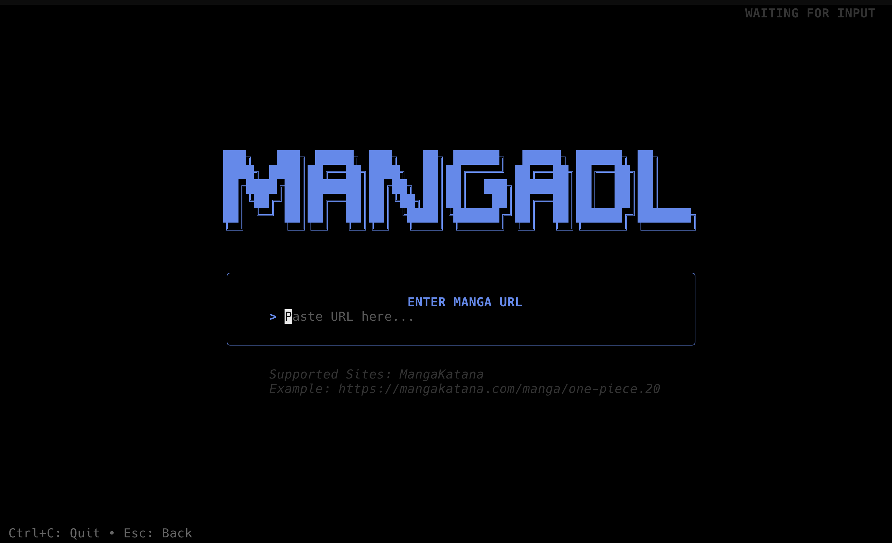
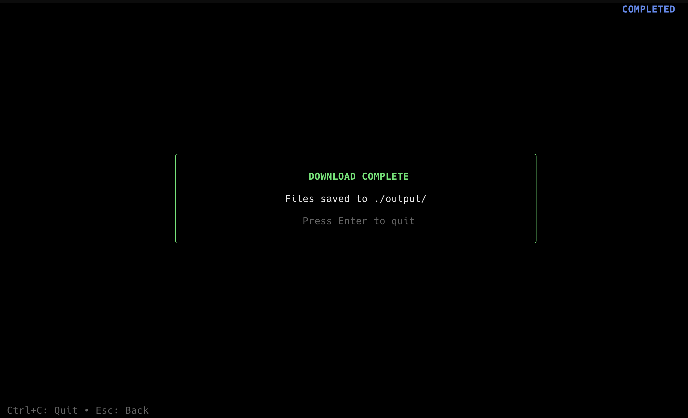

# mangadl

A command-line manga downloader written in Go.





## Requirements

- Go 1.25 or later

## Installation

Clone the repository:

```bash
git clone https://github.com/Anchalrawat/mangadl.git
cd mangadl
```

Install dependencies:

```bash
go mod download
```

## Building

**Linux / macOS (x86-64)**

```bash
GOOS=linux GOARCH=amd64 go build -o mangadl main.go
```

**Linux ARM (32-bit, e.g. Raspberry Pi)**

```bash
GOOS=linux GOARCH=arm GOARM=7 go build -o mangadl main.go
```

**Linux ARM64 (e.g. Raspberry Pi 4, Apple Silicon servers)**

```bash
GOOS=linux GOARCH=arm64 go build -o mangadl main.go
```

**macOS (Apple Silicon)**

```bash
GOOS=darwin GOARCH=arm64 go build -o mangadl main.go
```

**macOS (Intel)**

```bash
GOOS=darwin GOARCH=amd64 go build -o mangadl main.go
```

**Windows (x86-64)**

```bash
GOOS=windows GOARCH=amd64 go build -o mangadl.exe main.go
```

**Windows ARM64**

```bash
GOOS=windows GOARCH=arm64 go build -o mangadl.exe main.go
```

**iSH (iOS) — emulates x86 Linux**

```bash
GOOS=linux GOARCH=386 go build -o mangadl main.go
```
